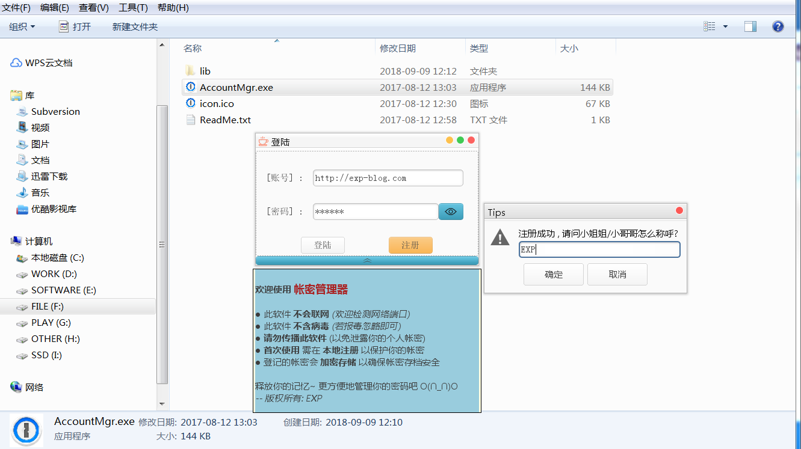
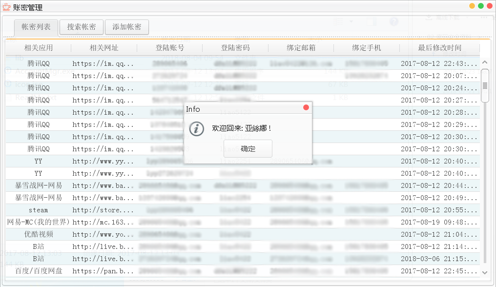
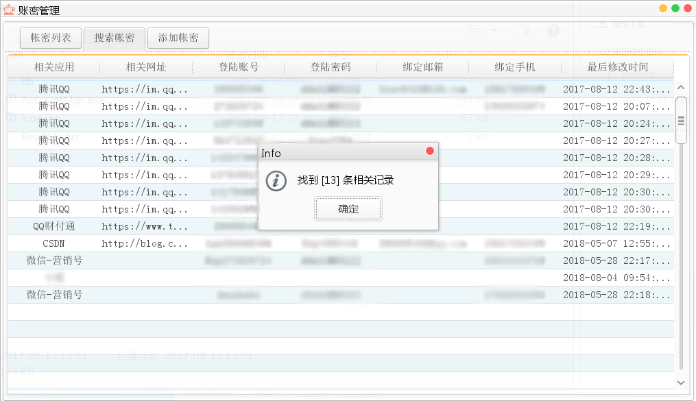
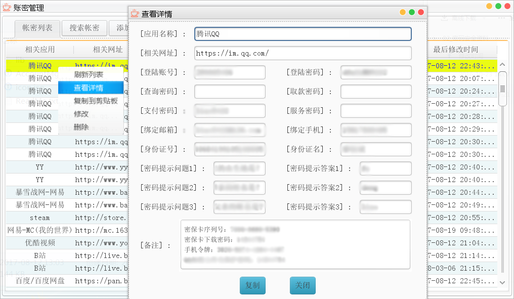

# Account-Manager
> 帐密管理器

------

## 运行环境

     

## 软件介绍

现在我们的生活已经被各种各样的账号密码缠绕，就本人而言，已经有近百个帐密需要记忆，这是很恐怖的事情

- 你是否仍在苦恼如何保存这些帐密？
- 记录到小本本？丢了被人捡到怎么办？
- 记录到电脑文档？被修电脑的复制了怎么办？
- 记录到云盘？被恶意分享了怎么办？
- 记录到脑袋？失忆了怎么办？
- 使用同一个密码？被撞库了怎么办？

为此我写了这么一个帐密管理工具，目的就是释放自己的记忆，更方便更安全地管理所有帐密

- 此软件不会联网（不怕你检测网络端口哦）, 不含后门病毒
- 登记到其中的所有帐密均使用DES加密再保存，避免被提取本地文件破译

> 若杀毒软件报毒，忽略即可，请放心使用。当然如果你不信任此软件，直接删除就好了，与其担心受怕还不如自己写一个类似的软件最安全不是吗？

      
## 运行展示

- 首次运行需要注册（*仅在本地注册，不联网*），相当于生成一个保护所有帐密的口令：  
- 登陆成功后，可查看所有已录入的帐密列表：  
- 通过搜索功能快速找到已录入的目标帐密：  
- 右击目标条目查看帐密详情：  

## 下载

见 [Release](https://github.com/lyy289065406/account-mgr/releases/)

## 安装与使用

1. 安装JDK环境【[jdk-1.8](https://github.com/lyy289065406/environment/tree/master/environment/java/JDK/windows/x64/jdk-8u191-windows-x64.exe)】，一直 下一步 到完成即可（无需修改安装路径）
2. 解压并运行【AccountMgr.exe】
3. 首次使用时，输入任意帐密（不要忘记哦）后，点击【注册】
4. 注册成功或再次使用时，输入所注册的帐密后，点击【登陆】
5. 点击【添加帐密】按钮可新增一个条目，按需填写即可
6. 点击【搜索帐密】按钮可查找已录入的相关目标条目
7. 在帐密列表上【右击】某个条目，可执行【查看详情】、【复制到剪贴板】、【修改】、【删除】等操作
   
> ***由于帐密信息保存在本地，请勿在使用后再压缩传播此软件，否则可能会因此泄露你的个人帐密*** 
> ***若您的朋友有诉求，建议通过本页面获取下载*** 
> ***请妥善保护好您的个人帐密，也不要利用此工具去骗取他人帐密*** 

